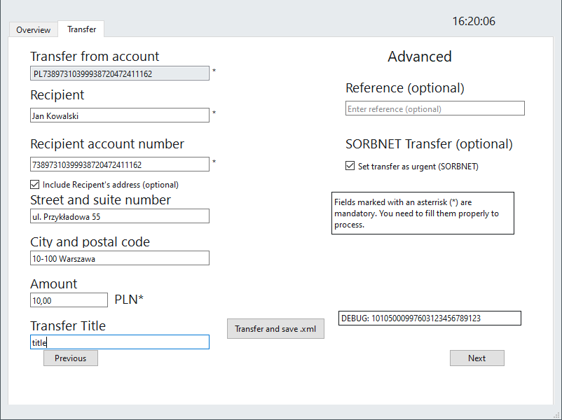

# project-bank-transfers-iso-20022
Project: a simulated bank application to generate XML transfer files, according to the [ISO 20022: Payments Initiation](https://www.iso20022.org/iso-20022-message-definitions) standard.
<p align="center">
   
</p>

## Description
The purpose of the project was to create a database application for simulated bank transactions between accounts, with additional XML transfer files, consistent with the [ISO 20022: Payments Initiation](https://www.iso20022.org/iso-20022-message-definitions) standard: more specifically the CustomerCreditTransferInitiationV11 (pain.001.001.11) XML Schema.

The project uses [gSoap](https://www.genivia.com/dev.html) for XML data binding (creating C++ classes from XML Schema file) and [TinyXML-2](https://github.com/leethomason/tinyxml2) for XML Parsing. It was created in [Qt Creator](https://www.qt.io/product/development-tools) IDE and thus also uses Qt framerwork for its interface.

## Features
- User login based on accounts defined in the MariaDB database, with SHA384-encrypted passwords.
- Transactions are reflected on users' account balances.
- Transactions can be saved as XML files ...
- and are also saved in the database.

### Login Window
<p align="center">
   
</p>

### Database
The .sql database file is included in the `database` directory.

## Examle transfer file
```xml
<?xml version="1.0" encoding="UTF-8"?>
<Document xmlns="urn:iso:std:iso:20022:tech:xsd:pain.001.001.11" xmlns:SOAP-ENV="http://schemas.xmlsoap.org/soap/envelope/" xmlns:SOAP-ENC="http://schemas.xmlsoap.org/soap/encoding/" xmlns:xsi="http://www.w3.org/2001/XMLSchema-instance" xmlns:xsd="http://www.w3.org/2001/XMLSchema" xmlns:ns1="urn:iso:std:iso:20022:tech:xsd:pain.001.001.11">
	<CstmrCdtTrfInitn xmlns="">
		<GrpHdr>
			<MsgId>AUR202335XX7095936301</MsgId>
			<CreDtTm>2023-03-05T15:20:42Z</CreDtTm>
			<NbOfTxs>1</NbOfTxs>
			<InitgPty>
				<Id>
					<PrvtId>
						<Othr>
							<Id>666694854</Id>
						</Othr>
					</PrvtId>
				</Id>
			</InitgPty>
		</GrpHdr>
		<PmtInf>
			<PmtInfId>70959364</PmtInfId>
			<PmtMtd>TRF</PmtMtd>
			<ReqdExctnDt>
				<Dt>2023-3-5</Dt>
			</ReqdExctnDt>
			<Dbtr>
				<Nm>Adam Nowak</Nm>
				<PstlAdr>
					<Ctry>PL</Ctry>
					<AdrLine>Wiejska 11/23</AdrLine>
					<AdrLine>00-021 Warszawa</AdrLine>
				</PstlAdr>
			</Dbtr>
			<DbtrAcct>
				<Id>
					<IBAN>PL73897310399938720472411162</IBAN>
				</Id>
			</DbtrAcct>
			<DbtrAgt>
				<FinInstnId>
					<ClrSysMmbId>
						<ClrSysId>
							<Cd>PLKNR</Cd>
						</ClrSysId>
						<MmbId>73897310</MmbId>
					</ClrSysMmbId>
				</FinInstnId>
			</DbtrAgt>
			<CdtTrfTxInf>
				<PmtId>
					<InstrId>70959365</InstrId>
					<EndToEndId> </EndToEndId>
				</PmtId>
				<PmtTpInf>
					<SvcLvl>
						<Cd>RTGS</Cd>
					</SvcLvl>
				</PmtTpInf>
				<Amt>
					<InstdAmt Ccy="PLN">10</InstdAmt>
				</Amt>
				<CdtrAgt>
					<FinInstnId>
						<ClrSysMmbId>
							<MmbId>73897310</MmbId>
						</ClrSysMmbId>
					</FinInstnId>
				</CdtrAgt>
				<Cdtr>
					<Nm>Jan Kowalski</Nm>
					<PstlAdr>
						<Ctry>PL</Ctry>
						<AdrLine>ul. Przykładowa 55</AdrLine>
						<AdrLine>10-100 Warszawa</AdrLine>
					</PstlAdr>
				</Cdtr>
				<CdtrAcct>
					<Id>
						<Othr>
							<Id>73897310399938720472411162</Id>
						</Othr>
					</Id>
				</CdtrAcct>
				<Purp>
					<Prtry>PLKR</Prtry>
				</Purp>
				<RmtInf>
					<Ustrd>title</Ustrd>
				</RmtInf>
			</CdtTrfTxInf>
		</PmtInf>
	</CstmrCdtTrfInitn>
</Document>
```

## Third party
[Qt](https://www.qt.io/)

[gSoap](https://www.genivia.com/docs.html)

[TinyXML-2](https://github.com/leethomason/tinyxml2)

[Sliding Stacked Widget](https://github.com/Qt-Widgets/Sliding-Stacked-Widget)

[libiban](https://github.com/Darth-Revan/libiban)

## License
[MIT](https://choosealicense.com/licenses/mit/)
